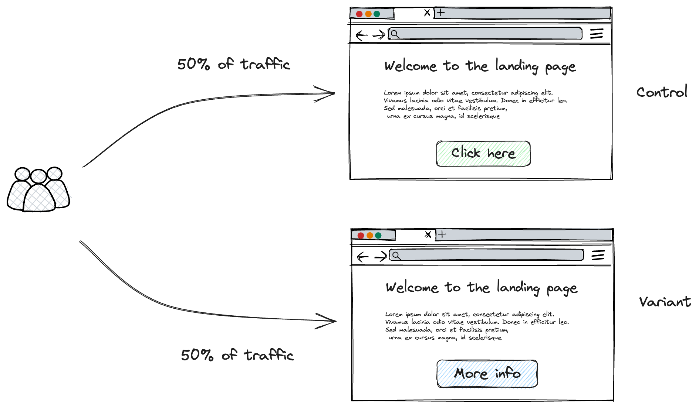

In this chapter we give a brief overview of A/B testing

## What is A/B testing?

A/B testing is a method used online to compare a new product or feature with the existing version. Two user groups are involved: one sees the current version (control set) and the other sees the new version (variant or experiment). The goal is to observe any differences in their responses to determine which version is "superior".

As an example, imagine we have a landing page and we want to optimise the probability that the customr will go to the next page. The current landing page has the call to action button "click here". However, our team might hypothesis that customers would be more likely to click on a button that writes "More info". To test this hypothesis, we would direct half of our traffic to the intial landing page (control), and the other half to the new version (variant)

{ align=left }

## Brief History of A/B tests

A/B testing, often termed split testing, has its origins in the experimental designs and statistical hypothesis testing of the early 20th century, pioneered by British statistician and biologist Ronald A. Fisher. His foundational work in agriculture involved controlled experiments to assess the impacts of various treatments on crop yields. As the century progressed, these principles expanded into fields like psychology, medicine, and notably, marketing. By the dawn of the internet era in the late 20th century, the digital landscape became fertile ground for A/B testing in its contemporary form. Tech giants of the early 2000s, such as Google, Amazon, and Microsoft, harnessed A/B testing to refine their websites, products, and campaigns—Google's testing of 41 shades of blue for a button being a famous example. 

The 2010s saw the democratization of A/B testing, with tools emerging that catered to smaller businesses and individual developers. However, its widespread adoption also brought ethical dilemmas to the forefront, exemplified by controversies like Facebook's 2014 emotion manipulation study. Today, A/B testing stands as a cornerstone in digital marketing, UX design, and product development, continually adapting with technological and analytical advancements.

