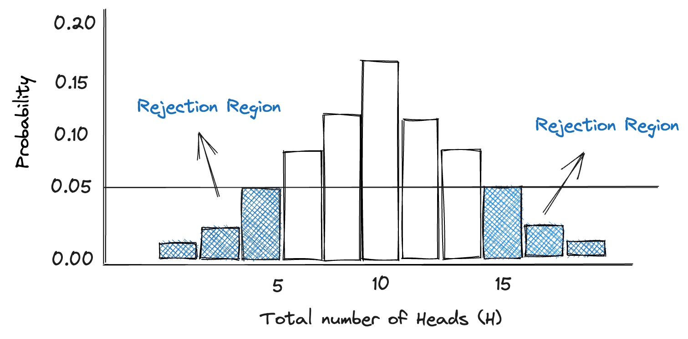

<script>
    function highlightWords() {
        var words = document.querySelectorAll('.highlight-word');
        words.forEach(function(word) {
            word.style.backgroundColor = 'rgba(147, 112, 219, 0.6)';
        });
    }

    function unhighlightWords() {
        var words = document.querySelectorAll('.highlight-word');
        words.forEach(function(word) {
            word.style.backgroundColor = 'transparent';
        });
    }
</script>


# Introduction to P-values

In this chapter we cover the definition of the infamous P-value, explain it using a simple example, show you how to calculate the value itself, and how where it falls in the world of experiments. 


## Too Long; Dont Wanna Read

<div style="border: 2px solid darkblue; border-radius: 10px; padding: 14px; background-color: #f9f9f9; box-shadow: 0 4px 8px rgba(0, 0, 0, 0.1), 0 6px 20px rgba(0, 0, 0, 0.1); transition: transform 0.3s, box-shadow 0.3s; cursor: pointer;" onmouseover="this.style.transform='translateY(-10px) scale(1.05)'; this.style.boxShadow='0 12px 16px rgba(0, 0, 0, 0.2), 0 10px 30px rgba(0, 0, 0, 0.2)'; highlightWords();" onmouseout="this.style.transform=''; this.style.boxShadow='0 4px 8px rgba(0, 0, 0, 0.1), 0 6px 20px rgba(0, 0, 0, 0.1)'; unhighlightWords();">

P-value is a measure used in statistics to help you decide if your <span class="highlight-word" style="background-color: transparent;">null hypothesis</span> (the assumption that there is no effect or relationship) is likely to be true or not. It's the probability that you would observe the data you have (or more extreme data) if the <span class="highlight-word" style="background-color: transparent;">null hypothesis</span> is true.
<br> <br>
A small P-value (typically ≤ 0.05) suggests strong evidence against the <span class="highlight-word" style="background-color: transparent;">null hypothesis</span>, so you reject the <span class="highlight-word" style="background-color: transparent;">null hypothesis</span>. A large P-value (> 0.05) suggests weak evidence against the <span class="highlight-word" style="background-color: transparent;">null hypothesis</span>, so you fail to reject the <span class="highlight-word" style="background-color: transparent;">null hypothesis</span>.
<br> <br>

Remember, P-value is not the probability that the <span class="highlight-word" style="background-color: transparent;">null hypothesis</span> is true, nor it is the probability that your alternative hypothesis is false. It's just a tool to help decide whether to reject the <span class="highlight-word" style="background-color: transparent;">null hypothesis</span>.
</div>


## What is the P-value?

For many years, the p-value has been widely recognized and used in statistical testing. It has played a crucial role in both scientific and business communities, in which it is primarily used to determine if a result is significant or not. Unfortunately, the P-value is probably the most misunderstood and misinterpreted statistical index. We hope to break this cycle in the following chapter.

If you start looking around the internet for the definition of the P-value, you will find a lot mumbo jumbo that even senior analysts have a tough time unwrapping (or remembering for that matter). Don't worry, I will give you this formal defintion, so no need to scour the internet, but I will also devote a few paragraphs to explain in lay terms so that the concept sticks.  

???+ Note "*Formal Definition*: P-Value"

    In statistical hypothesis testing, the p-value is the probability of obtaining a result
    at least as extreme as the one that was actually observed, assuming that the null
    hypothesis is true.


I hope I didn't lose you with the statistical lingo - we will unpack it later, but for now we begin with a simple example. Imagine we stumble upon a silver coin in the park, and our friend asks us to perform an experiment to determine whether the coin is (1) fair, or (2) unfairly biased towards one-side. Before blindly doing this experiment, let's discuss, what are our intital thoughts and expectations? Well, surely if the coin is fair we would expect that the there is a 50% chance that the coin lands on heads or tails when flipped. On the other hand, an unfair coin, such as one that is weighed more heavily on the Heads side, would have a >50% chance of landing on heads when flipped. My personal expectation in a situation like this would be that the coin is actually fair. What's your guess?

Suppose you and I are very lazy experimenters and we just flip the coin 20 times to test if it's fair or not. After flipping it 20 times, we observe that the coin landed on heads 16 times. We are very happy with how our experiment went and confidently conclude that the coin is biased towards head.

???+ Example "Flipping the coin 20 times"

    H H H H H H H H H H T H T H H H T T T H H H     
        Heads = 16, Tails = 4

But now imagine our friend says; “ I don’t believe you, you just flipped it a certain way and the coin landed on heads 16 times by pure chance. The coin is NOT heavier on one side.” Before we can go on with our day, we need to address this critique. We have to show our friend that the data (16 heads) would not be expected if it was just random or by chance. Sure, it’s always *possible* a fair coin lands on heads 16 times, but we can show that it would be *very unlikely* if indeed the coin was fair, - and that's all we can reasonably do. I'm saying it again, all you can do is show that if the coin was fair, it would be very unlikely that we saw 16 heads. Therefore, it's more likely that the coin is biased towards heads.

Without knowing it, by doing this experiment we have also defined a null hypothesis. A null hypothesis is the starting point of all scientific discoveries because it begins and is formed with an assumption. The assumption could be that eating chocolate before a race makes you faster, cold showers increase social media screen time, or sharks are heavier than crocodiles. These might seem like absurd assumptions at first (or not .. I have never seen a post about a cold shower), but truly the only way to find the answer is to run an experiment, gather data, analyse the data, and make a conclusion - just like we did with the park coin. 

???+ Note "Null hypothesis"

    The null hypothesis is a default position or the commonly accepted fact, and one that we would like to test


In our coin example, the null hypothesis would be that coin is fair sided (50% chance of landing on Heads). The alternative here is that the coin is biased. Remember that the null hypothesis is seen as a theoretical expectation, and one that we would like to test using a data driven experiment approach. 

### Computing the P-value

Stating the null hypothesis is only half the job done. The rest relies on calculating the P-value, which is a probability. Earlier we said that the p-value is the probability of obtaining a result at least as extreme as the one that was actually observed, assuming that the null hypothesis is true. I'm sure you're yawning by now. What is this definition even saying? Let's break it down into digestible pieces

[`the p-value is the probability`], okay so we know we're dealing with probability, which means the p-value is a number between 0 and 1. 

[`of obtaining a result`] result.. as in conclusion, or as in event. Putting the two togther, we have "the probability of getting a result". Well, we do this all the time! The probability of rain is 10%. This is the probability of a obtaining a result (rain), right?

[`at least as extreme as the one that was actually observed`], "As least as extreme" - I would prefer to reframe this, "As we got or more extreme". Okay, now for the second part. The term "Actually observed" refers to the data collected from the experiment, like whether it rained or not, or the weight of sharks/crocodiles. Still, putting the three together doesn't quite register.

[`assuming that the null hypothesis is true`] This is the final piece of the puzzle that shows the full picture. Sometime I wonder, why did it have to go on the end? Let's send this statement to the front. "Assuming that the null hypothesis is true" - this means that we should start with a mental model in which our hypothesis is true, and this is BEFORE doing the experiment or collecting data. 

Putting it all together, p-value is the probability of “getting the data that you actually got” under the assumption that the null
hypothesis is actually true. If this still doesn't click, let's return to our coin example. The null hypothesis is that the coin is fair (i.e., P(Heads) = 0.5). We assume the hypothesis is true *before* we flip the coin. After flipping the coin 20 times, the p-value is the probability of getting 16 heads (the data we actually got). In a nutshell, the P-value summarises how likely it is that we got 16 heads (or more), if the coin was actually fair.

If the p-value from your experiment is small, it indicates that the null hypothesis is unlikely to be true. This is because P-values close to 0 indicate that the observed data is unlikely to be due to chance. At risk of sounding like a broken record, I will say it only once more. In terms of our example, the probablity of getting 16 heads or more, assuming the null is true (fair coin), is low - and therefore it is unlikely that we got 16 heads by pure chance. Something else is going on.  is the P-value acts as an index that measures the strength og evidence against the null hypothesis. In such a case, you decide to discard the null hypothesis. This outcome is referred to as a statistically significant result.

???+ Question "How small should the P-value be?"

    It is statistical convention that the null hypothesis is rejected if the p-value is smaller than or equal to the significance level, which is set at α = 0.05


Generally, if the P-value is lower than 0.05, we reject the null hypothesis. This outcome is referred to as a statistically significant result. It's up to the experiementer to choose the cut-off mark, but it has become rather ritualistic to use 0.05. If you have trouble remembering which decision to make with your P-value, I can share with you a slogan from my university days. It goes a little like this; `If the P is low, the null must go`. In other words, if the P-value is low, reject the null hypothesis.

#### Example: Flipping a coin

Let’s continue with our park coin example in which we test whether coin is fair, or biased towards Heads. Written in probability notation it would be; P(H) = 0.5. We start by defining our null hypothesis!

???+ Note "Null hypothesis: Coin example"

    - Null hypothesis (H0): The coin is fair, i.e. P(H) = 0.5 
    - Alternative hypothesis (Ha): The coin is biased towards heads: I.e P(H) > 0.5


Now, before doing the experiment (flipping the coin) and collecting data, we need to set our level of significance. In this example, we choose our value to be 5% (α = 0.05). This means that if the P-value is below this cut-off, we reject the null hypothesis. Next, we go ahead and run our experiment! We flip the coin 20 times in a row, and observe 16 heads.


At this point, we want to compute the P-value, which is the probability of obtaining a result at least as extreme as the one that was actually observed, assuming that the null hypothesis is true. Sigh.. this definition again. In OTHER words, we just want to know the probability of observing 16, 17, 18, 19 or 20 heads, assumung that the coin is far (P(H) = 0.5). The P-value is therefore the P(16 heads) + P(17 heads) + P(18 heads) + P(19 heads) + P(20 heads). To calculate the P(H) we use the binomial probability distribution with *n* =10 and *p*=0.5. 


```py title="binomial_test_one_sided.py"

from scipy.stats import binomtest

# Binomial test
p_value = binomtest(16, 20, 0.5, alternative='greater')

print(p_value)

```

<div style="font-family: monospace; font-size: 0.85em; color: #333; background-color: #f9f9f9; padding: 10px; margin-top: 10px; border-left: 3px solid #ddd;">
<b>Output:</b><br/>
BinomTestResult(k=16, n=20, alternative='greater', statistic=0.8, pvalue=0.005908966064453125)
</div>


Since the p-value calculated 0.0059 is lower than our cut-off of 0.05, we reject our null hypothesis that the coin is fair. 


## One-sided test

In the previous example, the null hypotheses was H0: coin is fair (p=0.5) and the alternative hypothesis was Ha: coin is biased toward heads (p>0.5). With this hypothesis and flipping the coin 20 times, the null hypothesis would only rejected if the number of heads in 20 coin tosses was some number greater than 15. The 'rejection region' (shown as the blue bars in the graphs below) lies in the right tail of the distribution of the number of heads in 20 tosses of a coin. This type of experiment is called a one-sided test becasuse the alternative has the 'greater than' symbol'.

{ align=left }

## Two sided test

On the other hand if you were testing H0: coin is fair (p=0.5) against the alternative hypothesis Ha: coin is not fair (p not equal to 0.5), you would reject the null hypothesis in favor of the alternative hypothesis if the number of heads was some number more than 15 or some number less than 5.  For example, we migh reject H0 in favour of the alternative if the number of heads was 3 or 18. If the alternative hypothesis has the not equals sign, then the rejection region would lie in both tails of the probability distribution of the number of heads.  This is shown by the shaded portion of the graph.  This is a two-tail test with rejection regions in both tails.

{ align=left }

```py title="binomial_test_two_sided.py"

# Two-sided Binomial test
p_value = binomtest(16, 20, 0.5, alternative='two-sided')

print(p_value)

```

<div style="font-family: monospace; font-size: 0.85em; color: #333; background-color: #f9f9f9; padding: 10px; margin-top: 10px; border-left: 3px solid #ddd;">
<b>Output:</b><br/>
BinomTestResult(k=16, n=20, alternative='two-sided', statistic=0.8, pvalue=0.01181793212890625)
</div>

However, note that when you use a significance level of 0.05 in a two-tailed test, you're splitting the 0.05 into two parts: 0.025 for each direction (or tail) of the test. This means you're checking for extreme values in both directions, with each direction having a 2.5% chance of occurring by random chance.

## Q&A

## Common misconceptions (Fighting Dolos)


