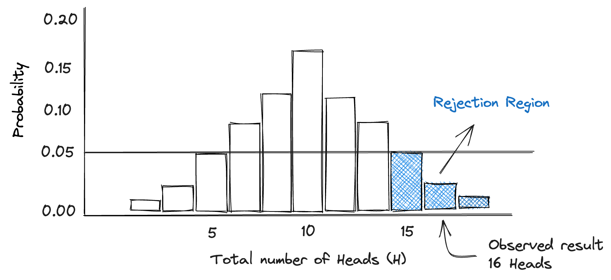

# P-value explained

## P-value story

Imagine we stumbled upon a shiny silver coin in the office, and for some reason your manager asks you to perform an experiment to determine whether the coin is fair, or unfairly biased towards heads. If the coin is fair, we would expect that the there is a 50% chance that the coin lands on heads or tails when flipped. On the other hand, an unfair coin, one that is weighed on the Heads side, would have a >50% of landing on heads when flipped. Now imagine we are very lazy experimenters; we just flip the coin 20 times, observe the number of times it lands on heads and call it a day. On this day, the coin landed on heads 16 times in a row, so we are very happy with ourselves and conclude that the coin is most definitely biased.

But now imagine the next day your arch nemesis comes to you and says; “ I don’t believe you, you just flipped it a certain way and the coin landed on heads 16 times by pure chance. The coin is not heavier on the Heads side.” Before you present your results to your boss, you need to address this critique. You have to show this person that your data would not be expected if it was just random or by chance. Sure, it’s always *possible* a fair coin lands on heads 16 times in a row, but you can show that it would be unlikely (or very unlikely) that this happens, and that's all you can reasonably do.

In this example, the coin being fair sided (50% chance of landing on Heads) is analogous to a null hypothesis. The null hypothesis is seen as a theoretical expectation, and one that we would like to test. 

The p-value is the probability of finding your result (16 heads), or least as extreme (17 to 20 heads in a row), given that we believe in the null hypothesis (fair sided coin world view). A very low p-value suggests that you saw something which would be very rare if the null hypothesis were actually true. In other words, it would be very rare that a fair sided coin lands on heads 16 times by chance alone. It’s definitely possible, but not very probable. This might make you think the coin is biased towards heads.

But how small should the p-value be for us to start doubting the fairness of the coin? That's where the significance level comes in. It's a threshold we set ourselves, usually at 0.05, or 5%.

## P-value code example

``` py title="bubble_sort.py"
def bubble_sort(items):
    for i in range(len(items)):
        for j in range(len(items) - 1 - i):
            if items[j] > items[j + 1]:
                items[j], items[j + 1] = items[j + 1], items[j]
```
The `#!python range()` function is used to generate a sequence of numbers.

???+ note

    Lorem ipsum dolor sit amet, consectetur adipiscing elit. Nulla et euismod
    nulla. Curabitur feugiat, tortor non consequat finibus, justo purus auctor
    massa, nec semper lorem quam in massa.

???+ question

    Lorem ipsum dolor sit amet, consectetur adipiscing elit. Nulla et euismod
    nulla. Curabitur feugiat, tortor non consequat finibus, justo purus auctor
    massa, nec semper lorem quam in massa.


<p align="center">
  
</p>

